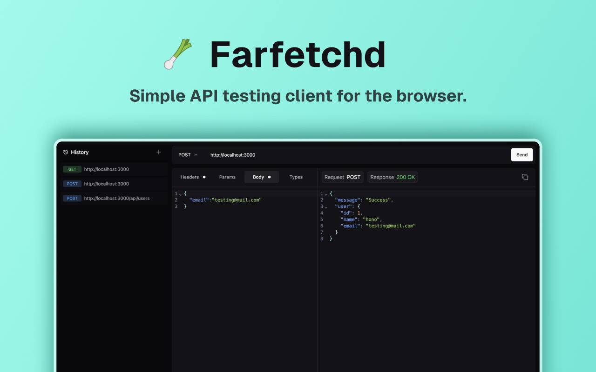

# Farfetchd

Farfetchd is a simple good looking online API testing client.

## Features

- **AI-powered body creation**: Create the body of your request with ease using Farfetchd's AI integration powered by [Ollama](https://ollamalab.com/). There's no need to write JSON or form-data by hand.
- **Cross-platform usage**: Use Farfetchd directly from your browser, no need for a specific operating system.
- **Easy to use**: Farfetchd is designed to be simple and intuitive for simple APIs testing.
- **CORS issue solver**: Farfetchd comes with a built-in CORS issue solver. Use the [Farfetchd Extension](https://github.com/JepriCreations/farfetchd-cors) to bypass the CORS issue when testing APIs locally. The extension will be available in the Extensions Store soon.
- **Light and Dark theme**: Are you in the dark side? Or are you in the light side? Automatically theme base on your system theme configuration.

## AI Configuration Instructions

Download Ollama from the official website. Once installed, open the terminal and run the command `ollama pull llama3.1`, which will download the basic llama3.1 model on your machine. Once the download is complete:

- In local: You can now use AI generation.
- In the web: You need to add "https://farfetchd.buildbuddy.one" to the Ollama environment variables `OLLAMA_ORIGINS` to avoid the CORS error, as explained in [How can I allow additional web origins to access Ollama?](https://github.com/ollama/ollama/blob/main/docs/faq.md#how-can-i-allow-additional-web-origins-to-access-ollama).

## Run in local

1. Clone the repository
2. Install dependencies E.g. `pnpm install`
3. Run the app E.g. `pnpm dev`
